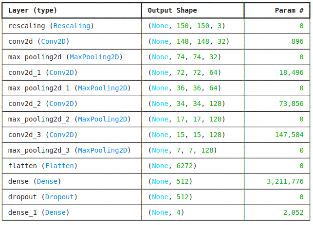
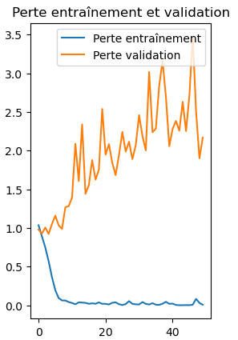
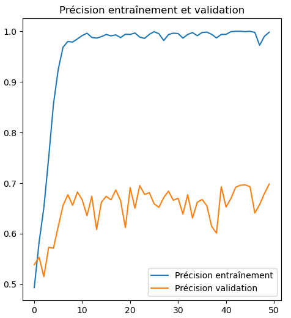

# 🧠 Alzheimer CNN - Détection de la Maladie d'Alzheimer

## 📌 Introduction
Ce projet utilise un **réseau de neurones convolutifs (CNN)** pour classifier des images IRM du cerveau en différentes catégories, selon le degré de sévérité de la maladie d'Alzheimer.

L'objectif est d'aider à la **détection précoce** de la maladie en analysant ces images.

## 📂 Structure du projet

📂 Alzheimer_CNN/
│── 📂 data/                  # Dossier contenant le dataset (non inclus sur GitHub)
│── 📂 results/               # Graphiques et métriques des performances
│── 📂 src/                   # Code source Python
│── .gitignore                # Liste des fichiers ignorés par Git
│── requirements.txt          # Dépendances Python
│── README.md                 # Documentation du projet
│── Projet_CNN.py             # Script principal du projet

## 🚀 Installation et utilisation

### 1️⃣ Cloner le projet
```bash

git clone https://github.com/TON-UTILISATEUR/Alzheimer_CNN.git
cd Alzheimer_CNN

### 2️⃣ Installer les dépendances

pip install -r requirements.txt

### 3️⃣ Lancer l'entraînement du modèle
python Projet_CNN.py


---

## ✅ **5. Ajouter les résultats**


```md
## 📊 Résultats
Les graphiques des courbes d'entraînement, de validation et des performances sont enregistrés dans le dossier **`results/`**.

Voici quelques exemples :




## 🗂️ Dataset
Le dataset utilisé contient des images IRM du cerveau, classées en plusieurs catégories selon le degré de sévérité de la maladie d'Alzheimer.

⚠️ **Le dataset n'est pas inclus dans ce dépôt**. Si vous souhaitez l'utiliser, téléchargez-le, il se trouve sur Kaggle et placez-le dans le dossier `data/`.

## 📜 Licence
Ce projet est sous licence MIT. Vous êtes libre de l’utiliser et de le modifier selon vos besoins.
